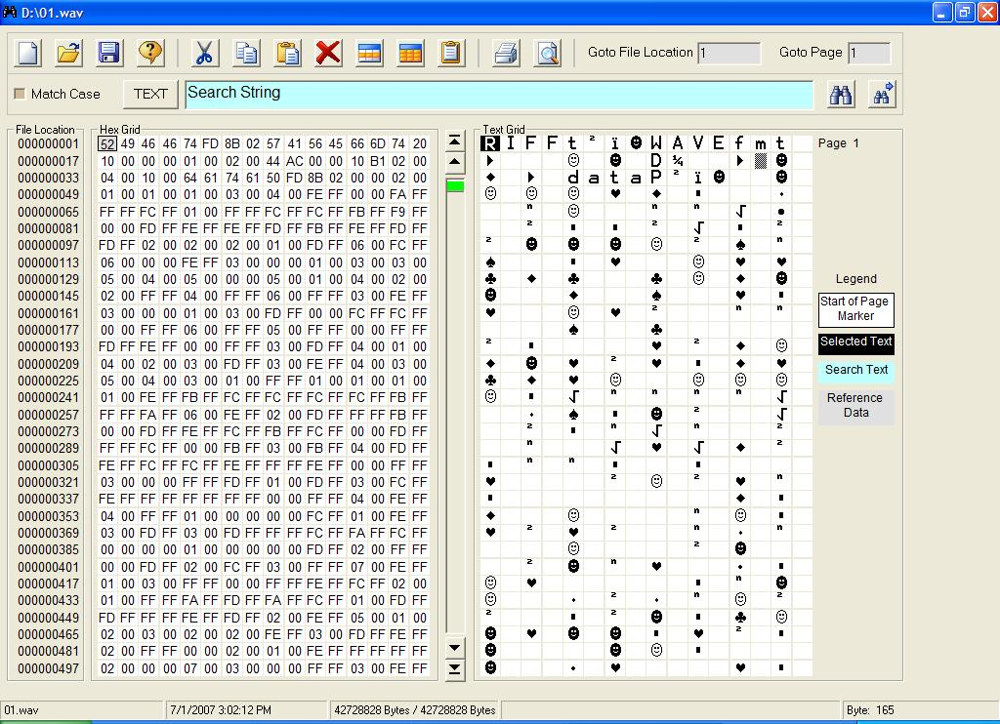

<div align="center">

## Binary File Editor


</div>

### Description

Create edit or view binary files. Basic features include data editing, exchanging data with external applications through the windows Clipboard, inserting new and deleting data. Other features include multiple selection cut and paste, powerful find command, goto file position, goto page position, and printing capabilities.

File Editor is highly optimized to quickly perform actions and file sizes up to 2 GB can be opened instantly.
 
### More Info
 


<span>             |<span>
---                |---
**Submitted On**   |2007-07-13 07:01:18
**By**             |[Richard Gagnon](https://github.com/Planet-Source-Code/PSCIndex/blob/master/ByAuthor/richard-gagnon.md)
**Level**          |Intermediate
**User Rating**    |4.9 (39 globes from 8 users)
**Compatibility**  |VB 6\.0
**Category**       |[Complete Applications](https://github.com/Planet-Source-Code/PSCIndex/blob/master/ByCategory/complete-applications__1-27.md)
**World**          |[Visual Basic](https://github.com/Planet-Source-Code/PSCIndex/blob/master/ByWorld/visual-basic.md)
**Archive File**   |[Binary\_Fil2075297132007\.zip](https://github.com/Planet-Source-Code/richard-gagnon-binary-file-editor__1-68949/archive/master.zip)

### API Declarations

```
Private Declare Function GetKeyState Lib "user32" (ByVal nVirtKey As Long) As Integer
Private Declare Sub CopyMemory Lib "kernel32" Alias "RtlMoveMemory" (Dest As Any, Source As Any, ByVal Length As Long)
Private Declare Function SetWindowPos Lib "user32" (ByVal hwnd As Long, ByVal hWndInsertAfter As Long, ByVal x As Long, ByVal y As Long, ByVal cx As Long, ByVal cy As Long, ByVal wFlags As Long) As Long
```


